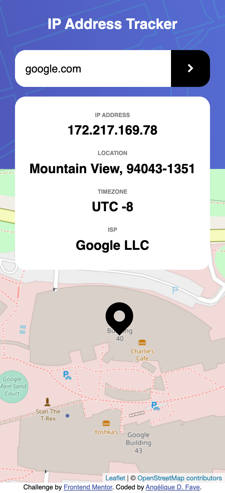

# IP address tracker app


<div align="center">
  
  
  
</div>

## Overview

_Locate any IP address or domain name!_

<br />

## Links

<p>
<a href="https://github.com/AngeliqueDF/ip-address-tracker-challenge">GitHub repo</a> • <a href="https://ip-address-tracker-app-typescript.vercel.app/">Live demo </a> • <a href="https://github.com/AngeliqueDF/ip-address-tracker-microservice">Repository of the backend</a>
</p>

<br />

## How to run the project

1. `git clone HTTPS_REPO_URL MY-FOLDER-NAME`
2. `cd MY-FOLDER-NAME`
3. `npm install`
4. `npm start`
5. visit [`http://localhost:1234`](http://localhost:1234)

### If you encounter a CORS error.

On localhost, some browsers will block the request to the geolocation APIs and throw a [CORS error](https://developer.mozilla.org/en-US/docs/Web/HTTP/CORS/Errors/CORSDidNotSucceed).

#### Workarounds

- Use a browser in incognito mode to test the app (worked in Chrome, Firefox Developer Edition).
- Check an ad blocker isn't preventing the requests.

<br />

## Features

- Responsive design.
- Accessible.
- Locates any IP address and displays its information in a readable table.

## Technologies

- HTML
- CSS
- TypeScript
- Leaflet
- Geolocation APIs (IP-API.com, Ipgeolocation.io)

<br />

## Description

This app is an IP address tracker built with HTML, CSS, and TypeScript. It is a challenge created by Frontend Mentor.

> Your users should be able to:
>
> - View the optimal layout for each page depending on their device's screen size
> - See hover states for all interactive elements on the page
> - See their own IP address on the map on the initial page load
> - Search for any IP addresses or domains and see the key information and location
>
> -- [IP Address tracker challenge by Frontend Mentor](https://www.frontendmentor.io/challenges/ip-address-tracker-I8-0yYAH0)

<br />

### How I built this project

<p align="center">
	
</p>

#### HTML/CSS

1. First built the UI with a mobile first approach. The design has two breakpoints: at 375px and 1440px. See the [style guide](./style-guide.md).

#### TypeScript

At first, I tried to solve this challenge using a fast approach combining loops, global variables and a few functions.

But it became clear that a robust solution needed to be inspired from OOP concepts, where separate objects are responsible for simple tasks and interact if needed.

I implemented the following classes, then called their `public` methods in `app.ts` when a `'submit'` or `'DOMContentLoaded'` event occurred:

- Request information to the geolocation APIs with `IpAddressLocator.ts` and `DomainNameLocator.ts`.
- Populate the table with `PopulateTable.ts`.
- Integrate Leaflet with `AddressMapControl.ts`.

```js
// app.ts
"use-strict";
import IpAddressLocator from "./IpAddressLocator";
import AddressMapControl from "./AddressMapControl";
import PopulateTable from "./PopulateTable";
import DomainNameLocator from "./DomainNameLocator";

const appMap = new AddressMapControl();
const locator = new IpAddressLocator();
const infoDisplay = new PopulateTable();

export type IpAddressData = {
	// ...
};

/**
 * Locates and displays the information found about the client.
 * Called when the page is first loaded.
 */
const displayData = async (ipAddress = "") => {
	// ...
};

window.addEventListener("DOMContentLoaded", async () => {
	displayData();
	// ...
	searchElement.addEventListener("submit", async function (e) {
		// ...

		// If the field is empty, the value of ip in the URL is === "", therefore the API will return information about the client.
		if (search === "") {
			return displayData();
		} else {
			// Check the domain has a matching IP address
			// ...
			// Verify we received a truthy value after the check
			if (ipFromDomain) {
				displayData(ipFromDomain);
			}
		}
	});
});
```

Doing this, I avoided:

- Writing extra code just to create new tiles/layers for the map and then having to clean up after every search.
- Writing my own, potentially buggy code by taking advantage of the classes already available.
- Having one large code file which would have made debugging more difficult.

I also managed to make this app functional for free.

<br />

### Recommended technologies and tools

- VS Code type hints.
- TypeScript.
- The Leaflet library.
- IP-API.com to get a domain's IP.
- ipgeolocation.io to get any IP address information needed by the app.

<br />

## Status

The app works. But I am still reviewing the code.

### Planned changes

- [x] Make the app work when the user searches a domain name.

<!-- [See the advancement of the project here. PRs welcome!]() -->

## Sources

- [IP Address Tracker by Frontend Mentor.](https://www.frontendmentor.io/challenges/ip-address-tracker-I8-0yYAH0)

## Useful references

- [Display a custom marker](https://onestepcode.com/leaflet-markers-svg-icons/)
- [Leaflet's documentation](https://leafletjs.com/).

## Author

- [@AngeliqueDF on GitHub.](https://github.com/AngeliqueDF)
- [Visit my website.](https://adf.dev)
- [View my Frontend Mentor profile.](https://www.frontendmentor.io/profile/AngeliqueDF)
