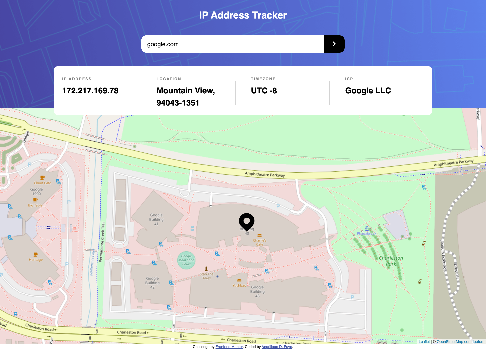

# IP address tracker app

  
  
  

## Overview

_Locate any IP address or domain name!_

 

## Links

<a href="https://github.com/AngeliqueDF/ip-address-tracker-challenge">GitHub repo</a> • <a href="https://ip-address-tracker-app-typescript.vercel.app/">Live demo </a>

 

## How to run the project

1. `git clone HTTPS_REPO_URL MY-FOLDER-NAME`
2. `cd MY-FOLDER-NAME`
3. `npm install`
4. `npm start`
5. visit [`http://localhost:1234`](http://localhost:1234)

## Features

- Responsive design.
- Accessible.
- Locates any IP address and displays its information in a readable table.

## Technologies

- HTML
- CSS
- TypeScript
- Leaflet
- Geolocation APIs (IP-API.com, Ipgeolocation.io)

 

## Description

This app is an IP address tracker built with HTML, CSS, and TypeScript. It is a challenge created by Frontend Mentor.

> Your users should be able to:
>
> - View the optimal layout for each page depending on their device's screen size
> - See hover states for all interactive elements on the page
> - See their own IP address on the map on the initial page load
> - Search for any IP addresses or domains and see the key information and location
>
> -- [IP Address tracker challenge by Frontend Mentor](https://www.frontendmentor.io/challenges/ip-address-tracker-I8-0yYAH0)

 

### How I built this project

	

#### HTML/CSS

1. First built the UI with a mobile first approach. The design has two breakpoints: at 375px and 1440px. See the [style guide](./style-guide.md).

#### OOP TypeScript

When planning this project, it became clear that a robust solution needed to use OOP concepts. Especially whenn use the Leaflet library properly. TypeScript helped as it added features that simplify the implementation of classes.

Doing this, I avoided:

- Writing extra code just to create new tiles/layers for the map and then having to clean up after every search.
- Writing my own, potentially buggy code by taking advantage of the classes already available.
- Having one large code file which would have made debugging more difficult.

I also managed to make this app functional for free. By using `node`'s native utilities.

 

### Recommended technologies and tools

- VS Code type hints.
- TypeScript.
- The Leaflet library.
- ipgeolocation.io to get any IP address information needed by the app.

 

## Status

The app works. But I am still reviewing the code.

### Planned changes

- [x] Make the app work when the user searches a domain name.

## Sources

- [IP Address Tracker by Frontend Mentor.](https://www.frontendmentor.io/challenges/ip-address-tracker-I8-0yYAH0)

## Useful references

- [Display a custom marker](https://onestepcode.com/leaflet-markers-svg-icons/)
- [Leaflet's documentation](https://leafletjs.com/).

## Author

- [@AngeliqueDF on GitHub.](https://github.com/AngeliqueDF)
- [Visit my website.](https://angeliquedf.dev)
- [View my Frontend Mentor profile.](https://www.frontendmentor.io/profile/AngeliqueDF)
